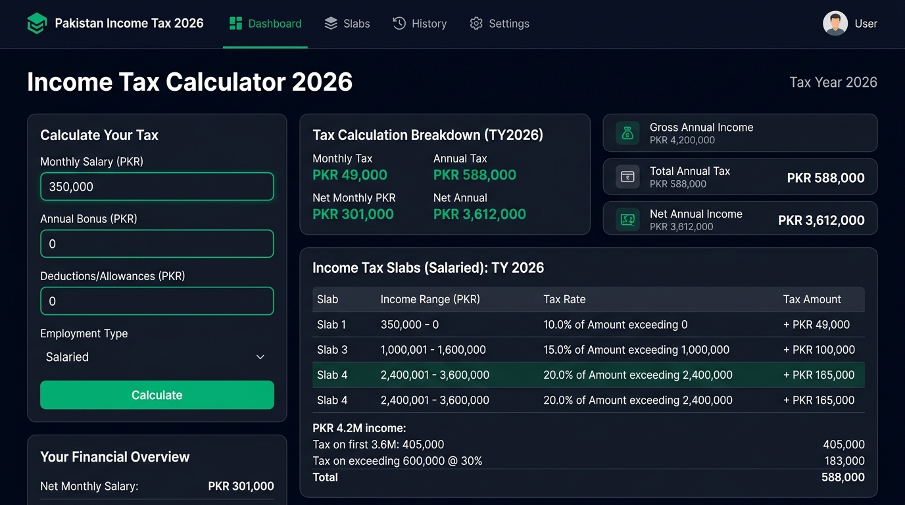
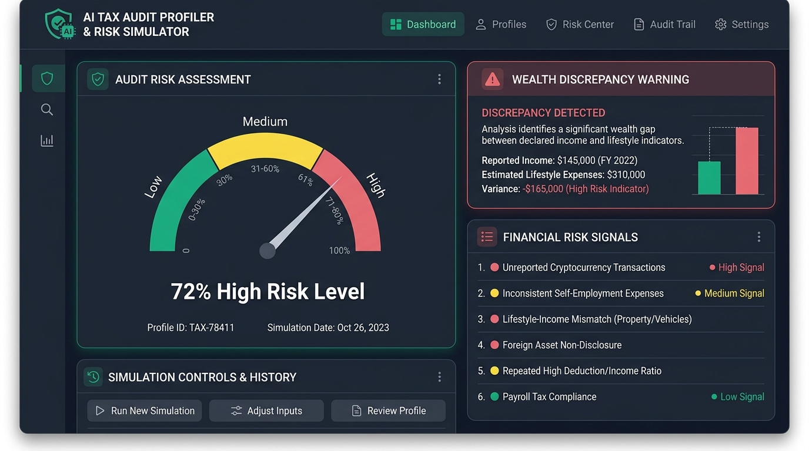
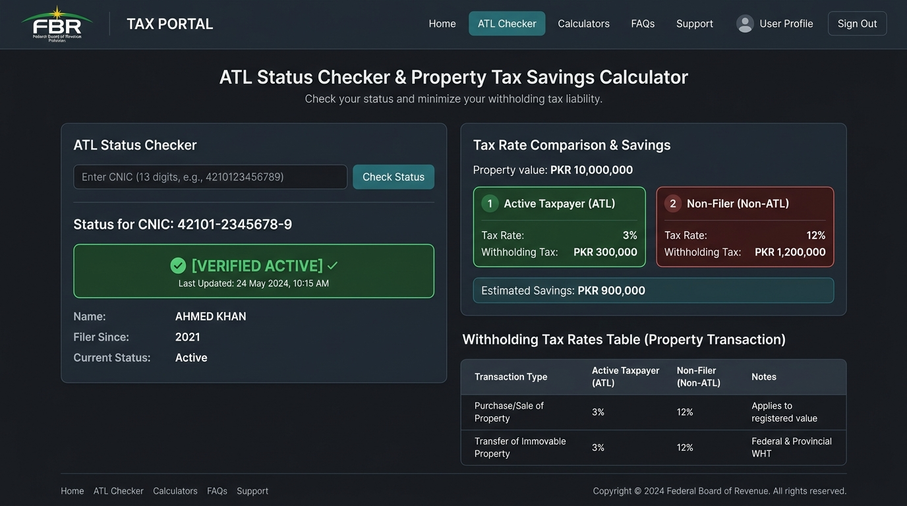
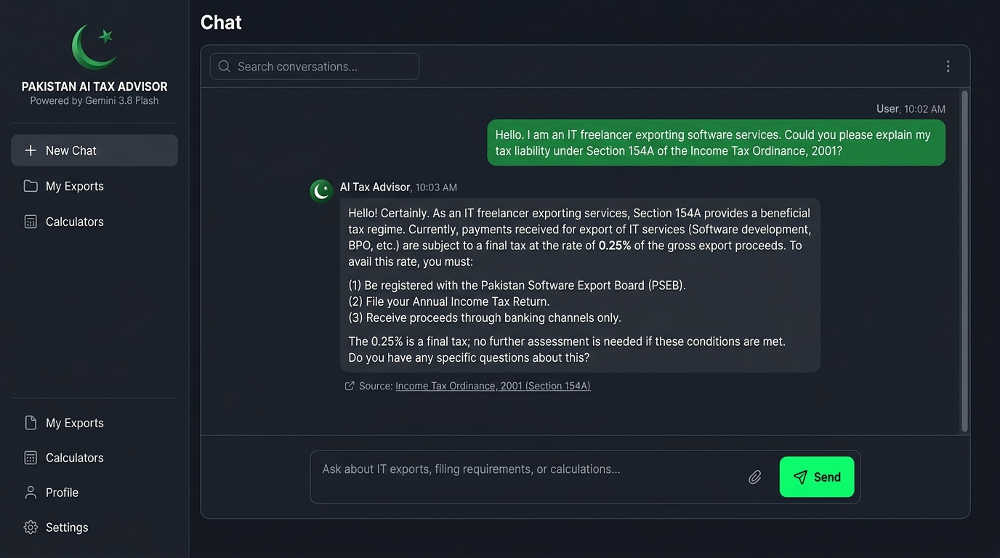

# 🇵🇰 Pakistan AI Taxation System 2026 (Tax Year 2025–2026)

🌐 **Live Application Link:** [https://ai-tax-system-pakistan-202.vercel.app/](https://ai-tax-system-pakistan-202.vercel.app/)

[](https://ai-tax-system-pakistan-202.vercel.app/)
[](https://www.typescriptlang.org/)
[](https://react.dev/)
[](https://ai.google.dev/)
[](https://tailwindcss.com/)

An advanced, AI-driven fiscal analytics, income tax engine, and active taxpayer portal tailored specifically for Pakistan's **Tax Year 2025–2026** under the **Income Tax Ordinance 2001** and recent **Finance Act 2025/2026** mandates. 

---

## 📌 Executive Summary

Pakistan's tax infrastructure faces severe structural imbalances, where fewer than **5.3 million active filers** bear the burden out of a population exceeding **240 million**. Over **60%** of federal revenues originate from regressive indirect taxation, placing an unsustainable load on salaried professionals and formal sector businesses.

The **Pakistan AI Taxation System 2026** bridges this critical gap. It provides citizens, IT exporters, salaried employees, and business owners with instant, accurate tax liability calculations alongside an AI-powered tax advisor, an automated risk audit simulator, an Active Taxpayer List (ATL) penalty calculator, and a deep policy diagnostic suite.

---

## 🎨 Visual & Aesthetic Design Principles

The application is built around strict, professional visual standards designed to eliminate "AI Slop" templates and deliver a trustworthy, high-density financial interface:

1. **High-Contrast Slate & Emerald Palette:**
   - **Backgrounds:** Deep Slate `#020617` (Slate 950) and `#0f172a` (Slate 900) for eye-safe contrast.
   - **Primary Accents:** Emerald `#10b981` (Emerald 500) and Teal `#14b8a6` (Teal 500) signifying growth, compliance, and financial accuracy.
   - **Penalty/Alert Colors:** Rose `#f43f5e` for non-filer penalties and high audit risks.

2. **Mathematical Typography & Monetary Clarity:**
   - **Primary Font:** Sans-serif UI typography optimized for scanability.
   - **Data Typography:** Monospaced numerical values (`font-mono`) to guarantee grid alignment across currency figures, tax slabs, and CNIC lookups.
   - **Bilingual Typographic Balance:** Seamless switching between English and Urdu (`اردو`) text without layout breakage.

3. **Compact Single-Line Macro Header:**
   - A streamlined, single-line horizontal metric bar displays top FBR indicators (Target: PKR 12.97T, Tax-to-GDP: 10.2%, ATL Filers: 5.3M) with an expandable detail toggle.

4. **Zero-Clutter Layout Hierarchy:**
   - Clear 12-column grid architectures with flat depth, subtle border boundaries (`border-slate-800`), and fluid smooth animations powered by `motion`.

---

## ⚡ Key Modules & Working Function Breakdown

### 1. 🧮 Interactive Income Tax Liability Calculator
Computes precise monthly and annual tax obligations based on official **Tax Year 2025–2026** Finance Act slabs.



* **Supported Tax Categories:**
  * **Salaried Individuals:** Slabs 1 through 6 with progressive rates (0% to 35% + fixed surcharges).
  * **Business & AOPs:** Non-salaried slabs up to 45%.
  * **IT & Software Exporters (Sec 154A):** Special 0.25% reduced rate with PSEB registration vs 1% standard rate.
  * **Real Estate Capital Gains & Rental Income:** Section 37 and Section 15B calculations.
* **Outputs:**
  * Monthly & Gross Income Breakdown
  * Exact Surcharge & Slab Calculations
  * Effective Tax Rate %
  * Net Take-Home Pay
  * Deductions Optimizer (Zakat, Medical Allowance, Provident Fund)

```
┌────────────────────────────────────────────────────────────────────────┐
│                        INCOME TAX CALCULATOR 2026                      │
├────────────────────────────────┬───────────────────────────────────────┤
│ Monthly Gross Salary:          │  PKR 350,000 / month                  │
│ Annual Gross Income:           │  PKR 4,200,000 / year                  │
│ Taxable Income (Excl. Zakat):  │  PKR 4,200,000                        │
├────────────────────────────────┼───────────────────────────────────────┤
│ Applicable Slab:               │  Slab 4 (PKR 3.2M to 4.1M)            │
│ Monthly Tax Deduction:         │  PKR 42,917 / month                   │
│ Annual Tax Liability:          │  PKR 515,000 / year                   │
│ Effective Tax Rate:            │  12.26%                               │
│ Net Monthly Take-Home:         │  PKR 307,083                          │
└────────────────────────────────┴───────────────────────────────────────┘
```

---

### 2. 🏛️ Pakistan Fiscal Structural Problems & AI Solutions
A diagnostics dashboard highlighting systemic bottlenecks and technical remedies.

* **Narrow Tax Base vs Population:** Only 2.2% of citizens file income tax returns.
* **Regressive Indirect Taxation:** High reliance on Sales Tax and FED penalizes lower-income households.
* **Retail Sector Evasion:** Massive cash-based transactions bypass traditional tax collection.
* **AI & Tech Remedies:**
  * Automated NADRA & SBP asset cross-verification.
  * POS QR-code invoice tracking on blockchain ledger.
  * Real-time automated audit notice generation using Gemini 3.6 Flash.

---

### 3. 🛡️ AI Risk Audit & Anomaly Profiler (Simulator)
Simulates how modern tax authorities evaluate taxpayer risk profiles by cross-analyzing declared income against declared wealth and lifestyle signals.



* **Inputs:** Declared Annual Income, Bank Turnover, Vehicle CC, Property Purchases, Foreign Trips.
* **Analysis Engine:** Calculates asset-to-income mismatch ratio.
* **Outputs:**
  * **Audit Risk Score:** Low (0-30%), Medium (31-60%), High (61-100%).
  * **Flagged Anomaly Warnings:** Pinpoints potential Section 111 (Unexplained Wealth) notices.
  * **Actionable Guidance:** Steps to rectify discrepancies prior to official notice issuance.

---

### 4. 🔍 Active Taxpayer List (ATL) & WHT Penalty Checker
Demonstrates the heavy financial penalties imposed on non-filers and non-active taxpayers across key transactions.



* **CNIC / NTN Status Lookup:** Verify Active (Fa'al) vs Non-Active status.
* **Real Estate WHT Savings Calculator (Sec 236K & 236C):**
  * **Active Filer Rate:** 3%
  * **Non-Filer Rate:** 12% (4x Penalty)
  * Direct savings calculation on property purchases (e.g. PKR 1.8 Million savings on a 2 Crore PKR plot).
* **Withholding Tax Matrix:** Comprehensive comparison for vehicle registration, dividend income, banking cash withdrawals, and international card payments.

---

### 5. 🤖 Gemini AI Tax Advisor Chatbot
An intelligent, context-aware chatbot powered by the **@google/genai SDK** and **Gemini 3.6 Flash**.



* **Bilingual Intelligence:** Fluent in English and Urdu (`اردو`).
* **Expertise:** Income Tax Ordinance 2001, FBR IRIS filing procedures, IT freelancer export regimes, wealth statement reconciliation, and tax planning strategies.
* **Preset Queries:** One-click prompts for quick calculations and guidance.

---

## 🛠️ Architecture & Tech Stack

* **Frontend Framework:** React 19 + TypeScript + Vite 6
* **Styling & UI Components:** Tailwind CSS v4 + Lucide React Icons
* **Animation & Motion:** Motion (Framer Motion replacement)
* **Backend Proxy:** Express.js Node Server
* **AI Engine:** Google Gemini 3.6 Flash (`@google/genai` SDK)
* **Deployment:** Vercel / Cloud Run Server-Side Proxy

---

## 💻 Local Installation & Setup

1. **Clone the Repository:**
   ```bash
   git clone https://github.com/your-username/ai-tax-system-pakistan-2026.git
   cd ai-tax-system-pakistan-2026
   ```

2. **Install Dependencies:**
   ```bash
   npm install
   ```

3. **Configure Environment Variables:**
   Create a `.env` file in the project root:
   ```env
   GEMINI_API_KEY=your_google_gemini_api_key_here
   ```

4. **Run Development Server:**
   ```bash
   npm run dev
   ```
   Open `http://localhost:3000` in your browser.

5. **Build for Production:**
   ```bash
   npm run build
   npm start
   ```

---

## 🎯 Our Mission

> **"To empower every citizen, entrepreneur, and freelancer in Pakistan with complete tax transparency, while providing a clear technological blueprint for data-driven, equitable, and automated fiscal governance."**
>
> We believe that a fair tax system is the cornerstone of economic sovereignty. By combining mathematical accuracy with artificial intelligence, our goal is to eliminate unfair non-filer distortions, expand the formal economy, protect the salaried class, and build a transparent financial future for Pakistan.

---
*Created for Fiscal Transparency, Educational Diagnostics & AI Reform in Pakistan.*
